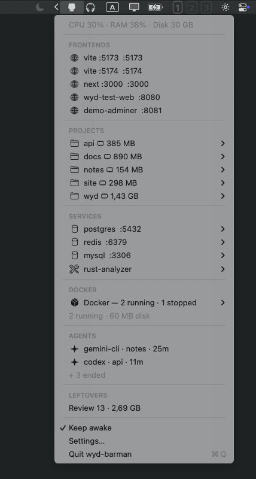
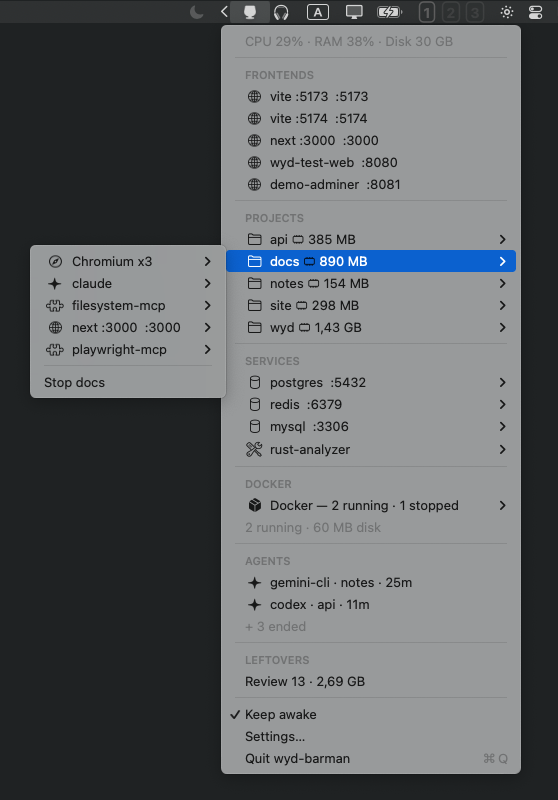
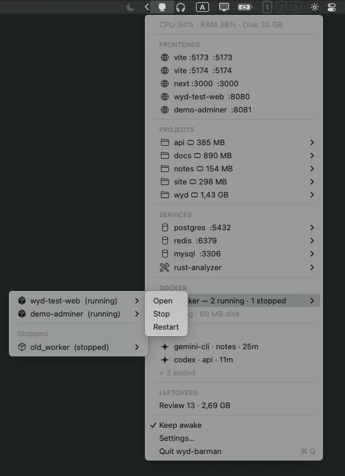

# wyd-barman

Tiny native macOS menu-bar remote control for [wyd](https://wyd.sh) — the engine.
No Dock icon, ~1 MB, near-zero idle CPU. Renders a cached `wyd barman snapshot`,
routes every action through `wyd`, never scans processes itself.

> Intelligence belongs in `wyd`. Convenience belongs in `wyd-barman`.



## What you get

- **STATUS** — one line: `CPU · RAM · Disk free`, measured by the engine.
- **FRONTENDS** — every running frontend (dev servers, docker-published
  ports); one click opens the browser. The engine verifies a port actually
  speaks HTTP before offering the URL — no name guessing.
- **PROJECTS** — per project: resources, RAM, Stop (with confirmation).
- **SERVICES / DOCKER** — databases and containers. Docker rolls up into a
  submenu (running first, then stopped) with a disk-usage line; stopped
  containers are not "leftovers", they are just stopped.
- **AGENTS** — active coding-agent sessions; ended ones are summarized as
  `+ N ended`.
- **LEFTOVERS → Review** — cleanup plan built by the engine (abandoned
  running processes + docker reclaimables; databases always protected).
  Deselect what you want to keep — still engine-validated on execute.
- **Keep awake** — one toggle: no system sleep, no display sleep, no screen
  saver (`IOPMAssertion`, no external processes).

Every row's submenu is built verbatim from the engine's `actions` array
(Open / Start / Stop / Restart); Force Kill is a two-step submenu. Stale
rows cannot hurt anything: the engine re-validates identity at execution
time (start_time check, never `killpg`), and a stale id just returns
"refresh", exit 2.

**Demo mode** — Settings toggle routes every call through the engine's
deterministic synthetic dataset: five projects, agents, dev servers,
docker stacks, leftovers. Safe to click around — nothing on the host is
touched. Great for screenshots.

## Requirements

- macOS 14+
- `wyd` 0.9.0+ with the `barman` subcommand — check:
  ```bash
  wyd barman version --json   # → {"schema_version": 1, ...}
  ```

## Install

```bash
git clone https://github.com/oxyplay/wyd-barman.git && cd wyd-barman
xcodebuild -project wyd-barman.xcodeproj -scheme wyd-barman -configuration Release build
cp -R ~/Library/Developer/Xcode/DerivedData/wyd-barman-*/Build/Products/Release/wyd-barman.app /Applications/
open -a /Applications/wyd-barman.app
```

The app locates `wyd` via, in order:

1. Settings override (file picker)
2. `/opt/homebrew/bin/wyd`, `/usr/local/bin/wyd`, `~/.local/bin/wyd`
3. Login-shell `PATH` (`zsh -l -c 'command -v wyd'`)

Missing → "wyd not found" with an install link, never a crash.
Incompatible schema → "wyd needs to be updated", never a decode crash.

## Architecture

```
wyd                          wyd-barman
discovery/ownership/safety   menu-bar UI only
  │ JSON: barman snapshot/action/cleanup-plan/execute/version
  ▼
WydClient (Process, argv only, 8s snapshot / 30s action timeouts)
  → AppState (cached snapshot, inFlight guard, non-modal banner errors)
  → MenuBarView / CleanupView / SettingsView
```

Refresh: on menu open + every 10 s while open; background poll every
3 min while closed. `inFlight` drops overlapping refreshes; an action
always triggers an immediate re-refresh.

No `ps`/`lsof`/`libproc`/`kill(` anywhere in Swift (the only process call
is the timeout-terminate in `WydClient`); no command-name heuristics —
classify in `wyd`, render here. Verify:

```bash
grep -rn "kill(\|lsof\|libproc\|brew services" App MenuBar State
```

## Performance (M1 Pro, measured)

| Metric | Value |
|---|---|
| `wyd barman snapshot --json` wall (live host, 28 resources + 9 containers) | 0.26–0.8 s |
| Menu-open latency | instant on cache |
| App bundle | 1.6 MB |
| Idle CPU | ~0 (timers only) |

No daemon/socket fast path until measurement proves the CLI is a problem.

## More screenshots





## License

Apache-2.0 — see [LICENSE](LICENSE).
